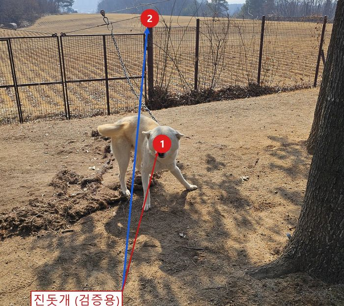
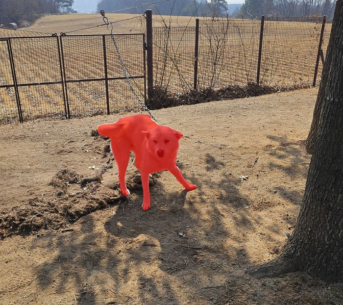
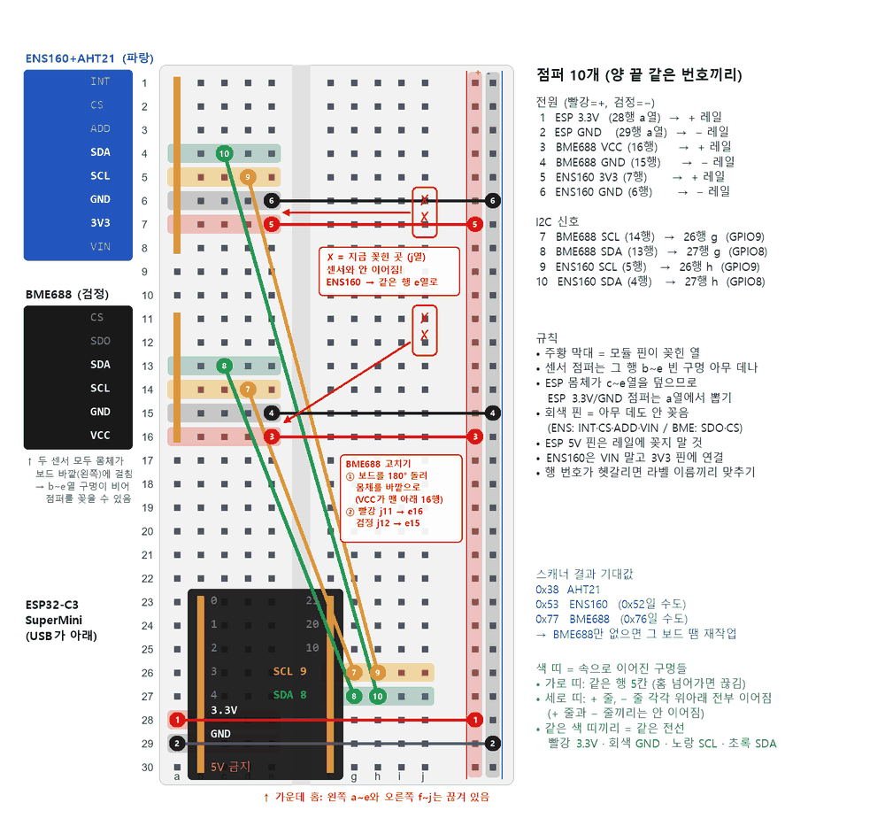
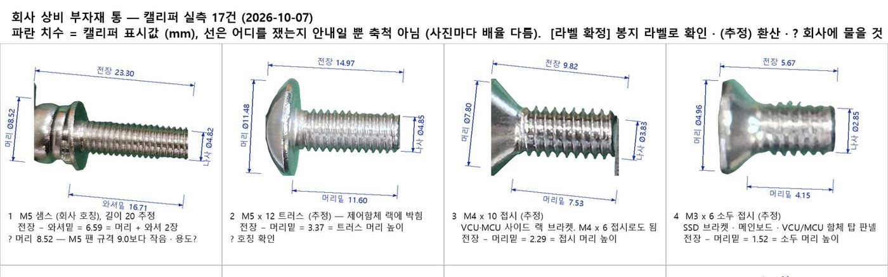

# Paint.NET MCP

AI에게 말로 요청해 Paint.NET에서 이미지를 만들고 수정할 수 있게 연결하는 Windows용 도구입니다. 배경과 그림, 글자를 따로 배치하고, 결과를 미리 본 다음 이미지 파일로 내보내거나 다시 수정할 수 있는 Paint.NET 문서로 저장할 수 있습니다.

MCP는 AI가 다른 프로그램의 기능을 사용할 수 있게 하는 연결 방식입니다. 이 저장소의 프로그램을 설치하고 MCP를 지원하는 AI 앱에 연결하면, AI가 Paint.NET의 그리기·편집 도구를 사용할 수 있습니다. Paint.NET은 컴퓨터에서 실행해 두어야 합니다.

그리기 명령은 Paint.NET에서 MCP Bridge 효과를 자동 실행해 반영합니다. 서버를 연결한 뒤에는 매번 메뉴나 Ctrl+F를 누를 필요가 없습니다.

[할 수 있는 작업](#할-수-있는-작업) · [실제 사례](docs/showcase.md) · [AI에게 요청하는 예시](#ai에게-요청하는-예시) · [설치](#설치) · [클라이언트 연결](#클라이언트-연결) · [사용법](#사용법) · [도구 목록](#도구-목록) · [검증](#검증)

## 할 수 있는 작업

| 만들거나 고칠 것 | 할 수 있는 일 |
| --- | --- |
| 썸네일·배너·공지 이미지 | 배경, 사진, 제목을 배치하고 글자 크기·색상·위치를 수정하기 |
| 같은 디자인의 여러 버전 | 기본 디자인에서 제목이나 날짜를 바꾸고 각각 이미지 파일로 내보내기 |
| 콜라주·설명 이미지 | 이미지의 일부를 별도 레이어로 복사해 이동·회전·확대·축소하기 |
| 기존 Paint.NET 문서 | 파일을 열어 레이어를 수정하고 전체 결과를 미리 보기 |
| 반복 편집 | 여러 그리기 작업을 묶어 적용하고 실행 취소·다시 실행하기 |

실제 작업에 써 본 네 가지 사례(사진에 번호·설명 붙이기, 점 하나로 물체 선택, 부품 사진 누끼 목록, 브레드보드 배선도)는 요청 문장과 결과 그림까지 [docs/showcase.md](docs/showcase.md)에 있습니다.

<a href="docs/showcase.md"></a> <a href="docs/showcase.md"></a> <a href="docs/showcase.md"></a>
<a href="docs/showcase.md"></a>

**레이어**는 투명한 종이를 여러 장 겹친 것과 같습니다. 배경, 사진, 제목을 각각 다른 장에 두면 제목만 옮기거나 사진만 바꿀 수 있습니다. **캔버스**는 그림을 만드는 전체 작업 공간입니다.

완성된 이미지를 올리거나 공유하려면 PNG·JPEG·WebP로 내보냅니다. 다음에 레이어와 글자를 다시 수정하려면 `.pdn` 파일도 함께 저장하세요. `.pdn`은 Paint.NET의 작업 문서 형식입니다.

MCP로 만든 편집 가능한 텍스트는 내용과 글꼴 정보를 함께 보관합니다. AI에게 다시 요청하거나 Paint.NET의 **MCP → 텍스트 편집…** 메뉴에서 직접 글자를 바꿀 수 있고, `.pdn`으로 저장했다가 다시 열어도 수정할 수 있습니다. Paint.NET 화면에서는 일반 그림 레이어로 보이며, 기본 텍스트 도구로 글자를 클릭해서 고치는 방식은 아닙니다. 일반 사진에 이미 찍혀 있는 글자나 `draw_text`로 그린 글자에는 이 기능이 적용되지 않습니다.

## AI에게 요청하는 예시

설치와 연결을 마친 뒤 **AI 앱의 대화창**에 아래처럼 입력하세요. 명령어를 외울 필요는 없습니다. AI가 요청에 맞는 도구를 선택하며, 결과는 Paint.NET 화면에서 확인할 수 있습니다. 전체 미리보기는 AI 앱의 이미지 표시 기능에 따라 대화창에서도 볼 수 있습니다.

### 1. 사진 없이 공지 이미지 만들기

> Paint.NET에 가로 1200, 세로 800픽셀 크기의 공지 이미지를 만들어줘. 배경은 연한 크림색으로 하고, 위쪽에 짙은 파란색으로 ‘토요일 보드게임 모임’, 아래에 ‘오후 2시 · 동네 카페’라고 써줘. 두 문장은 각각 나중에 수정할 수 있는 텍스트 레이어로 만들어줘. 전체 미리보기를 보여줘.

결과를 본 뒤에는 이렇게 이어서 요청할 수 있습니다.

> 제목을 조금 더 크게 하고 가운데로 옮겨줘. 날짜 문구는 ‘일요일 오후 3시’로 바꿔줘.

> 완성본을 내 바탕 화면에 `모임공지.png`로 내보내고, 다음에 수정할 수 있게 `모임공지.pdn`도 저장해줘. 저장 위치를 모르면 먼저 물어봐.

### 2. 내 사진으로 썸네일 만들기

> 내 컴퓨터의 사진 파일로 가로 1280, 세로 720픽셀 썸네일을 만들어줘. 사진은 왼쪽에, 오른쪽에는 ‘주말 여행 기록’이라는 큰 제목을 배치해줘. 사진과 제목은 별도 레이어로 두고, 제목은 나중에 수정할 수 있게 만들어줘. 사진 파일의 위치를 먼저 물어봐.

사진은 AI가 접근할 수 있는 컴퓨터에 있어야 합니다. 파일 위치가 필요하면 Windows 탐색기에서 사진을 오른쪽 클릭하고 **경로로 복사**를 선택해 AI에게 붙여 넣으세요. 메뉴에 보이지 않으면 Shift 키를 누른 채 오른쪽 클릭해 보세요.

> 사진을 조금 줄이고 제목을 아래로 옮겨줘. 전체 결과를 보여줘.

### 3. 같은 디자인으로 여러 공지 만들기

> 지금 만든 공지 디자인을 바탕으로 ‘독서 모임’, ‘영화 모임’, ‘산책 모임’ 버전을 만들어줘. 제목 레이어만 수정하고 배경과 배치는 유지해줘. 각 버전을 PNG와 수정용 PDN으로 저장해줘. 저장할 폴더는 먼저 물어봐.

### 4. 그림의 일부를 따로 옮기기

> 내가 Paint.NET에서 점선 테두리로 선택한 부분을 새 레이어로 복사해줘. 원본은 그대로 두고, 복사한 부분을 오른쪽으로 100픽셀 옮긴 다음 크기를 절반으로 줄여줘. 선택 영역을 해제하고 복사한 레이어 전체에 적용해줘.

원하는 부분을 Paint.NET의 선택 도구로 직접 표시한 뒤 요청하면 됩니다. 자동으로 물체의 윤곽을 찾거나 배경을 제거하는 작업은 사진과 사용 방식에 따라 결과가 달라집니다. AI 배경 제거에는 추가 프로그램인 rembg가 필요합니다.

### 5. 저장했던 문서 이어서 수정하기

> 전에 저장한 `모임공지.pdn`을 열어줘. MCP로 만든 제목을 ‘다음 주에 만나요’로 바꾸고 전체 미리보기를 보여줘. 마음에 들면 새 이름으로 PNG와 PDN을 저장할게. 파일 위치를 먼저 물어봐.

마음에 들지 않는 수정은 “방금 작업을 실행 취소해줘”라고 요청할 수 있습니다. 실행 취소는 현재 문서의 마지막 편집을 되돌리므로, 직접 편집한 작업이 섞여 있다면 무엇을 되돌릴지 확인하세요.

처음 설치할 때는 아래의 프로그램 설치와 AI 앱 연결 설정이 필요합니다. 연결 후 평소 작업은 대화로 요청하면 됩니다. 아래의 도구 이름과 코드 예시는 연결을 설정하거나 자동화하는 사람을 위한 참고 자료입니다.

## 요구사항

| 항목 | 요구사항 |
| --- | --- |
| 운영체제 | Windows |
| Paint.NET | 5.x — 실제 앱 검증 버전: 5.1.12 |
| 빌드 환경 | .NET 9 SDK |
| 기본 설치 경로 | `C:\Program Files\paint.net` |
| 선택 의존성 | AI 배경 제거·물체 선택: rembg CLI(`pip install "rembg[cpu,cli]"`) / OCR: Tesseract CLI |

rembg와 Tesseract는 해당 기능을 사용할 때만 필요합니다. 한국어 OCR에는 Tesseract의 한국어 언어 데이터도 필요합니다.

## 설치

저장소 루트의 일반 PowerShell에서 실행합니다. 먼저 작업을 저장하고 Paint.NET을 종료하세요.

```powershell
.\install.ps1
# 다른 설치 경로
.\install.ps1 -PaintDotNetDir 'D:\Apps\paint.net'
```

[install.ps1](install.ps1)은 서버와 Bridge를 빌드하고 플러그인 DLL 5개를 설치한 뒤 파일 해시를 확인합니다. 복사 권한이 부족하면 Windows UAC 창에서 관리자 권한을 요청합니다. Paint.NET이 실행 중이면 종료 안내와 함께 중단하며, 자동으로 종료하지 않습니다. 현재 저장소에서 빌드한 MCP 서버가 실행 중이면 빌드를 위해 종료합니다.

설치 후 Paint.NET에서 캔버스를 열고 MCP 클라이언트를 다시 연결하세요. Bridge는 플러그인 검색 중 시작되며, 연결 후 초기 스냅샷을 준비합니다. PowerShell 창은 닫아도 됩니다. 스크립트는 최초 설치와 코드 업데이트 때만 실행합니다.

실행 정책으로 스크립트가 차단되는 환경에서는 이번 실행에만 다음 명령을 사용할 수 있습니다.

```powershell
powershell -NoProfile -ExecutionPolicy Bypass -File .\install.ps1
```

### 빌드 및 배포

직접 빌드와 배포를 수행하는 경우의 명령입니다. 기본 설치 경로에 배포할 때는 관리자 PowerShell이 필요합니다.

```powershell
dotnet build -c Release
dotnet build src\PaintDotNetMcp.Bridge\PaintDotNetMcp.Bridge.csproj -c Release -t:Deploy
```

Paint.NET이 다른 경로에 설치되어 있다면 두 명령에 같은 경로를 지정합니다.

```powershell
dotnet build -c Release -p:PaintDotNetDir="D:\Apps\paint.net"
dotnet build src\PaintDotNetMcp.Bridge\PaintDotNetMcp.Bridge.csproj -c Release -t:Deploy -p:PaintDotNetDir="D:\Apps\paint.net"
```

`Deploy` 대상은 Bridge 프로젝트에 정의되어 있습니다. 솔루션 전체에 `-t:Deploy`를 지정하지 마세요.

### 배포 스크립트

관리자 PowerShell에서 직접 배포하거나 기존 빌드 결과만 복사하려면 [deploy.ps1](deploy.ps1)을 사용할 수 있습니다. 자동 권한 요청을 포함한 설치는 위의 `install.ps1`을 사용하세요.

```powershell
.\deploy.ps1
# 다른 설치 경로
.\deploy.ps1 -PaintDotNetDir 'D:\Apps\paint.net'
# 기존 빌드 결과만 배포
.\deploy.ps1 -SkipBuild
```

스크립트는 파일 잠금을 해제하기 위해 실행 중인 `PaintDotNetMcp.Server` 프로세스를 종료합니다. Paint.NET은 자동 종료하지 않습니다.

### 수동 설치

`src\PaintDotNetMcp.Bridge\bin\Release\net9.0-windows\`의 다음 파일을 Paint.NET의 `Effects` 폴더로 복사합니다.

- `PaintDotNetMcp.Bridge.dll`
- `PaintDotNetMcp.Contracts.dll`
- `SkiaSharp.dll`
- `libSkiaSharp.dll`
- `System.Drawing.Common.dll`

설치 또는 업데이트 후 Paint.NET과 연결된 MCP 클라이언트를 다시 시작하세요.

## 클라이언트 연결

서버는 stdio 방식으로 통신합니다. MCP 클라이언트가 다음 실행 파일을 시작하도록 설정합니다.

```text
<저장소 경로>\src\PaintDotNetMcp.Server\bin\Release\net9.0\PaintDotNetMcp.Server.exe
```

아래는 `mcpServers` 형식의 설정 예시입니다. 경로는 실제 저장소 위치로 바꾸세요. 클라이언트에 따라 설정 파일 위치와 형식은 다를 수 있습니다.

```json
{
  "mcpServers": {
    "paintdotnet": {
      "command": "C:\\Projects\\paintdotnet-mcp\\src\\PaintDotNetMcp.Server\\bin\\Release\\net9.0\\PaintDotNetMcp.Server.exe"
    }
  }
}
```

Claude Desktop에서는 `%APPDATA%\Claude\claude_desktop_config.json`에 설정합니다. 프로젝트별 설정을 사용하는 클라이언트에서는 서버가 현재 작업 폴더에 등록되어 있는지도 확인하세요.

## 사용법

1. Paint.NET에서 이미지 또는 새 캔버스를 엽니다.
2. MCP 클라이언트를 연결합니다. Tools 메뉴를 누를 필요 없이 Bridge가 초기 스냅샷을 준비합니다.
3. `ping`에서 `ConnectionStatus=ready`, `SnapshotReady=true`인지 확인합니다. 다른 상태이면 `RecoveryAction`의 안내를 따릅니다.
4. 그리기 도구를 호출합니다. 기본 설정에서는 MCP Bridge가 자동으로 실행됩니다.
5. `wait_for_idle`로 완료를 확인한 뒤 이미지를 읽거나 저장합니다.

여러 작업을 한 번에 적용하려면 다음 순서를 사용합니다.

```text
begin_batch()
fill(r=230, g=40, b=15)
draw_rectangle(x=100, y=100, width=100, height=100, r=10, g=100, b=240, fill=true)
end_batch()
wait_for_idle(timeoutMs=5000)
save_png(path="C:\out\canvas.png")
```

위 예시는 도구 호출 순서를 나타냅니다. PowerShell 명령이 아닙니다. 좌표와 크기는 픽셀 단위이며 그리기는 활성 레이어에 적용됩니다.

`begin_batch`는 현재 문서와 레이어에 작업 묶음을 시작하고 자동 실행을 잠시 끕니다. `end_batch`는 그리기를 한 번에 실행하고 Paint.NET의 Undo 한 단계로 기록된 것을 확인한 뒤 이전 자동 실행 설정을 복원합니다. 빈 배치는 이력을 만들지 않습니다. 배치 도중에는 탭·레이어·선택 영역을 바꾸거나 수동 편집을 하지 마세요. 실행 실패나 취소 시 배치는 유지되어 `end_batch`로 재시도할 수 있습니다.

`undo`와 `redo`는 활성 문서의 Paint.NET 이력을 한 단계씩 이동합니다. 수동 편집 이력도 대상입니다. 이후 활성 레이어의 스냅샷을 직접 갱신하므로 읽기·저장에 즉시 반영되고, 스냅샷 갱신이 새 Undo 이력을 만들지는 않습니다. 이동할 이력이 없으면 `changed=false`를 반환합니다. 배치 또는 미적용 그리기가 남아 있으면 먼저 적용해야 합니다.

### 완료 확인

`auto_triggered=true`는 실행 요청을 예약했다는 뜻입니다. 렌더링 완료를 뜻하지 않습니다.

`wait_for_idle`은 호출 시점까지 요청된 그리기의 모든 타일이 복사되고 읽기·저장용 스냅샷이 갱신될 때 성공합니다. `timeoutMs`의 기본값은 5000이며 허용 범위는 0–60000입니다. 이 도구 자체는 효과 실행을 요청하지 않습니다.

스냅샷 읽기·저장·이미지 처리 도구도 대기 중인 그리기가 있으면 최대 5초 기다립니다. 시간 초과나 렌더링 오류가 발생하면 이전 스냅샷으로 작업을 진행하지 않습니다.

진행 상태는 `ping`의 `PendingOpCount`, `QueuedRevision`, `CompletedRevision`, `RenderError`에서 확인할 수 있습니다. 완료 판정은 Paint.NET의 최종 효과 수락이나 Undo 이력 반영까지 관찰하지 않습니다.

## 도구 목록

### 연결 및 실행

| 도구 | 기능 |
| --- | --- |
| `ping` | 버전, 캔버스 크기, 대기 작업, 완료 리비전, 오류 조회 |
| `commit` | 자동 실행 설정과 관계없이 MCP Bridge 실행 요청 |
| `wait_for_idle` | 그리기와 스냅샷 갱신 완료 대기 |
| `set_auto_commit` | 그리기 후 자동 실행 켜기·끄기 |
| `begin_batch`, `end_batch` | 여러 그리기를 하나의 Undo 단계로 적용 |
| `undo`, `redo` | 활성 문서의 이력 이동 및 읽기 스냅샷 갱신 |
| `diagnose_services` | 내부 서비스 연결 진단 |

### 그리기

| 도구 | 기능 |
| --- | --- |
| `fill` | 전체 또는 지정 영역 단색 채우기 |
| `draw_rectangle`, `draw_ellipse`, `draw_polygon` | 도형의 외곽선 또는 내부 그리기 |
| `draw_line` | 선 그리기 |
| `draw_text` | 시스템 폰트로 텍스트 그리기 |
| `create_text_layer` | 원문·폰트·위치·색을 보존하는 편집 가능한 텍스트 레이어 생성 |
| `update_text_layer` | 텍스트 속성 변경 후 해당 레이어 다시 렌더링 |
| `get_text_layer`, `list_text_layers` | 텍스트 속성 및 픽셀 변경 여부 조회 |
| `open_text_editor` | 사용자가 직접 수정할 수 있도록 현재 텍스트 레이어의 Paint.NET 편집 창 열기 |
| `flood_fill` | 지정 픽셀에서 허용 오차에 따라 채우기 |
| `gradient_fill` | 선형 또는 방사형 그라디언트 |
| `paste_image` | base64 PNG를 지정 좌표에 합성 또는 덮어쓰기 |

### 이미지 읽기 및 처리

| 도구 | 기능 |
| --- | --- |
| `get_canvas_png` | 활성 레이어 전체 또는 영역을 base64 이미지로 반환 |
| `save_png` | 활성 레이어 전체 또는 영역을 파일로 저장 |
| `get_document_image` | 표시된 모든 레이어를 합성해 MCP 이미지 응답으로 미리보기 |
| `export_document` | 표시된 모든 레이어의 합성 결과를 이미지 파일로 내보내기 |
| `extract_region` | 지정 영역 추출 및 선택적 저장 |
| `remove_background` | 색상 기반 또는 AI 배경 제거, 선택적 레이어 반영 |
| `detect_objects` | 균일한 배경의 객체 경계 검출 |
| `extract_objects` | 검출된 객체를 개별 파일로 저장 |
| `ocr_region` | Tesseract로 지정 영역의 텍스트 인식 |

이름이 `*_png`인 읽기·저장 도구도 `format` 옵션으로 PNG, WebP, JPEG를 지원합니다. `format=auto`이면 저장 경로의 확장자에서 형식을 추론하며, 경로가 없으면 PNG를 사용합니다. `quality`는 WebP·JPEG에 적용됩니다.

`savePath`가 있는 추출·배경 제거 요청은 기본적으로 base64를 반환하지 않습니다. 이미지가 필요한 경우 `includeBase64=true`를 지정하세요. 배경 제거 결과를 레이어에 붙일 때는 무손실 PNG를 사용합니다.

### 레이어, 문서, 효과 및 선택

| 도구 | 기능 |
| --- | --- |
| `open_image` | 절대 파일 경로로 이미지를 열고 활성 문서로 전환 |
| `new_canvas` | 지정한 픽셀 크기의 새 흰색 캔버스 생성 |
| `copy_selection_to_layer` | 선택한 픽셀을 원래 위치의 새 투명 레이어로 복사 |
| `resize_canvas` | 픽셀 배율을 유지하며 모든 레이어의 캔버스 크기 변경 |
| `crop_to_selection` | 기본 선택 영역으로 모든 레이어 자르기 |
| `transform_layer` | 활성 레이어 픽셀의 이동·확대/축소·회전 |
| `list_layers` | 레이어 목록 조회 |
| `add_layer`, `delete_layer`, `select_layer` | 레이어 추가·삭제·활성화 |
| `save_pdn` | 문서를 Paint.NET 형식으로 저장 |
| `list_effects`, `apply_effect` | 효과 목록 조회 및 실행 요청 |
| `set_selection_rect`, `set_selection_polygon`, `clear_selection` | 선택 영역 설정 및 해제 |
| `get_selection` | 현재 기본 선택 영역의 표시 여부와 캔버스 내 범위 조회 |

레이어·문서·효과 실행과 기본 선택 연동은 Paint.NET 내부 API에 의존합니다. 사각형·다각형 선택은 Paint.NET의 기본 점선 테두리로 표시되며 이미지 픽셀은 변경하지 않습니다. 내부 API를 사용할 수 없으면 오류를 반환합니다.

## 작업 예시

### 문서 준비

```text
new_canvas(width=1200, height=800)
# 또는 기존 파일 열기
open_image(path="C:\images\source.png")
```

두 도구는 Paint.NET의 기본 문서 생성·파일 로더를 사용하며 새 문서를 활성화하고 읽기·저장용 스냅샷을 바로 준비합니다. 수정한 기존 문서는 닫지 않습니다. `open_image`는 절대 경로의 기존 파일을 받으며 Paint.NET에서 지원하는 형식을 엽니다. 형식에 따라 로딩 옵션이나 오류 창이 표시될 수 있습니다.

`new_canvas`의 기본 크기는 800×600이며 해상도는 96 DPI입니다. 각 변은 1~16384픽셀, 전체는 최대 6400만 픽셀로 제한합니다. 배치 진행 중이거나 미적용 그리기가 있으면 문서를 전환할 수 없습니다. 먼저 `end_batch` 또는 `commit`과 `wait_for_idle`로 기존 작업을 적용하세요.

### 레이어 배치

```text
clear_selection()
transform_layer(offsetX=100, offsetY=50)
wait_for_idle()
transform_layer(scaleX=0.5, scaleY=0.5, angleDegrees=30)
wait_for_idle()
```

`transform_layer`는 활성 레이어의 픽셀을 변환합니다. 배율은 1이 원래 크기, 0.5가 절반, 2가 두 배입니다. 피벗 주변에서 확대/축소한 다음 시계 방향으로 회전하고 마지막에 픽셀 단위로 이동합니다. 피벗은 기본적으로 캔버스 중심이며 `pivotX`, `pivotY`로 지정할 수 있습니다. 좌표의 원점은 캔버스 왼쪽 위 모서리입니다.

캔버스 크기는 유지되므로 밖으로 나간 픽셀은 잘리고 빈 영역은 투명해집니다. 현재 선택 영역은 변환 결과가 적용되는 영역을 제한합니다. 전체 레이어를 변환하려면 먼저 `clear_selection`을 호출하세요. 기본 `interpolation="bilinear"`는 투명도를 고려해 부드럽게 보간하며, 픽셀 아트에는 `"nearest"`를 사용할 수 있습니다. Undo/Redo와 `begin_batch`/`end_batch`를 지원합니다.

### 선택 영역 미리보기

```text
set_selection_rect(x=40, y=30, width=100, height=80)
get_selection()
# 다각형으로 교체
set_selection_polygon(pointsJson='[{"x":60,"y":40},{"x":260,"y":40},{"x":60,"y":240}]')
```

선택 테두리는 Paint.NET 화면에서 확인하고 기본 선택 도구로 직접 조정할 수 있습니다. `get_selection`은 수동 조정한 현재 선택도 조회합니다. `NativeVisible`은 캔버스와 겹치는 선택의 표시 여부, `X`, `Y`, `Width`, `Height`는 캔버스 안의 선택 경계 상자입니다. 경계 상자는 다각형 자체의 모양을 나타내지는 않습니다. `IsEmpty=true`는 선택이 없는 상태이며 이후 그리기는 전체 캔버스에 적용됩니다. 이때 반환 좌표와 크기는 0입니다.

설정·해제는 Undo/Redo를 지원하며 `HistorySteps`로 추가된 단계 수를 반환합니다. 이미 해제된 선택을 다시 해제하면 0입니다. 캔버스와 전혀 겹치지 않는 선택 요청은 거부하고 기존 선택을 복원합니다. 배치나 미적용 그리기가 있으면 먼저 해당 작업을 끝내세요.

### 선택한 부분을 새 레이어로 분리

```text
set_selection_rect(x=40, y=30, width=100, height=80)
copy_selection_to_layer(name="Cutout")
clear_selection()
transform_layer(offsetX=100, offsetY=50)
wait_for_idle()
```

활성 레이어에서 선택된 픽셀을 원본 바로 위의 새 레이어로 복사하고 그 레이어를 활성화합니다. 원본 픽셀과 캔버스 좌표는 유지되고 선택 밖은 투명합니다. 다각형도 선택의 픽셀 커버리지에 따라 복사하며 경계 페더링은 적용하지 않습니다. 복사는 Undo 한 단계입니다. 이어서 레이어 전체를 이동하려면 선택을 해제하세요.

### 캔버스 크기 변경과 자르기

```text
resize_canvas(width=1600, height=1000, anchor="center")
set_selection_rect(x=100, y=100, width=800, height=600)
crop_to_selection()
```

`resize_canvas`는 이미지 배율을 바꾸지 않고 모든 레이어의 크기를 변경합니다. `anchor`는 `top_left`, `top`, `top_right`, `left`, `center`, `right`, `bottom_left`, `bottom`, `bottom_right` 중 하나입니다. 추가 공간은 기본적으로 투명하며 `r`, `g`, `b`, `a`로 채울 색을 지정할 수 있습니다. 크기를 줄이면 앵커를 기준으로 밖의 픽셀이 잘립니다. 크기 제한은 `new_canvas`와 같습니다.

`crop_to_selection`은 Paint.NET의 기본 자르기를 사용합니다. 다각형 선택은 경계 상자 크기로 자르고 모양 밖을 투명하게 만듭니다. 두 도구 모두 선택을 해제하고 Undo 한 단계로 픽셀·크기·선택을 복원합니다. 같은 크기로 변경하면 이력을 추가하지 않습니다. 복사·크기 변경·자르기는 배치나 미적용 그리기가 있으면 먼저 해당 작업을 끝내야 합니다.

### 편집 가능한 텍스트

#### Paint.NET에서 직접 수정하기

1. 오른쪽 레이어 목록에서 MCP로 만든 제목이나 날짜 레이어를 선택합니다.
2. 상단 **MCP → 텍스트 편집…** 메뉴를 엽니다. AI에게 “현재 텍스트 편집 창을 열어줘”라고 요청해도 됩니다.
3. 문구, 글꼴, 크기, 위치를 바꾸고 **색 고르기…**로 색상을 선택합니다. 불투명도는 255가 완전히 보이는 상태, 0이 투명한 상태입니다.
4. **적용**을 누르면 해당 레이어를 다시 그립니다. **취소**나 창 닫기는 변경을 적용하지 않습니다. 적용한 수정은 Paint.NET의 실행 취소로 되돌릴 수 있습니다.
5. 다음에도 수정하려면 문서를 `.pdn`으로 저장합니다.

텍스트 레이어에 직접 그림을 그리거나 크기를 바꾼 경우에는 덮어쓰기를 기본적으로 막습니다. **추가로 그린 그림을 지우고 텍스트만 다시 만들기**를 선택하면 해당 레이어 전체를 저장된 텍스트 정보로 다시 만듭니다. 창을 열어 둔 사이 문서나 대상 레이어가 교체되면, 창을 닫고 다시 열어야 합니다.

#### AI로 수정하기

```text
create_text_layer(
  name="Heading", text="Paint.NET MCP\n한글 텍스트",
  x=30, y=20, fontFamily="Malgun Gothic", fontSize=32,
  bold=true, r=30, g=80, b=180
)
update_text_layer(text="수정한 제목", fontSize=40, x=60, y=40)
get_text_layer()
save_pdn(path="C:\out\banner.pdn")
```

활성 레이어 위에 텍스트 전용 레이어를 만들고 원문·폰트·스타일·위치·색을 함께 저장합니다. `update_text_layer`에서 생략한 속성은 유지됩니다. 기본 대상은 활성 레이어이며 `layerIndex`로 다른 텍스트 레이어를 지정할 수 있습니다. 수정 시 레이어의 전체 픽셀을 원문에서 다시 그리므로 기존 글자가 남지 않고 폰트 크기를 바꿔도 새 크기로 렌더링합니다. 레이어 표시 여부·불투명도·혼합 모드는 유지하며 대상 레이어를 활성화합니다.

Paint.NET에서는 일반 비트맵 레이어로 보이고 텍스트 수정은 MCP 도구로 합니다. `.pdn`에는 텍스트 속성이 남아 다시 열어도 수정할 수 있습니다. PNG·WebP·JPEG로 내보낸 이미지에는 편집 속성이 남지 않습니다. 생성·수정은 각각 Undo 한 단계이며 속성과 픽셀을 함께 복원합니다. 같은 속성으로 수정하면 이력을 추가하지 않습니다. 선택 영역은 텍스트 레이어 생성·수정을 제한하지 않으며 배치나 미적용 그리기가 있으면 먼저 끝내세요.

레이어에 직접 그림을 추가하거나 `transform_layer`, 캔버스 크기 변경·자르기로 픽셀 또는 크기를 바꾼 경우 `PixelsModified=true`로 표시하고 텍스트 수정은 거부합니다. 해당 변경을 Undo하거나, 저장된 텍스트로 레이어 전체를 교체하려는 경우에만 `replaceModifiedPixels=true`를 지정하세요. 텍스트 이동·크기 조정에는 `update_text_layer`의 `x`, `y`, `fontSize`를 사용하는 편이 좋습니다. 기존 `draw_text`로 그린 픽셀에는 텍스트 속성이 없으므로 이 도구로 수정할 수 없습니다.

### 전체 레이어 미리보기와 내보내기

```text
get_document_image()
export_document(path="C:\out\banner.png")
export_document(path="C:\out\banner.webp", quality=90)
# 합성 결과의 일부만 내보내기
export_document(path="C:\out\crop.png", x=100, y=50, width=400, height=200)
```

Paint.NET의 합성 엔진으로 레이어 순서·표시 여부·불투명도·혼합 모드를 반영합니다. 미리보기는 MCP 이미지 콘텐츠로 반환하며 내보내기는 절대 경로에 PNG·WebP·JPEG로 저장합니다. PNG는 투명도를 보존하고 `quality`는 WebP·JPEG에 적용됩니다. 영역 지정은 캔버스와 겹치는 부분으로 잘리고 반환 크기는 실제 이미지 크기입니다.

원본 레이어를 병합하지 않고 선택 영역과 Undo 이력도 유지합니다. 진행 중인 배치는 먼저 `end_batch`로 끝내세요. Paint.NET의 수동 도구에서 아직 확정하지 않은 편집 오버레이는 합성에 포함되지 않습니다. 활성 레이어만 읽거나 저장하려면 기존 `get_canvas_png`, `save_png`를 사용하세요.

### 픽셀 텍스트 그리기

```text
draw_text(
  x=30, y=20, text="Paint.NET MCP\n한글 텍스트",
  fontFamily="Malgun Gothic", fontSize=32, bold=true,
  r=30, g=80, b=180
)
wait_for_idle()
```

`draw_text`는 활성 레이어의 픽셀에 직접 그리며 편집 속성을 보존하지 않습니다. 설치된 폰트와 지원하는 스타일을 지정하며, 없는 폰트를 요청하면 오류를 반환합니다. `draw_text`와 편집 가능한 텍스트 레이어의 `fontSize`는 픽셀 단위로 0보다 크고 512 이하, 텍스트는 공백만 있는 문자열을 제외한 최대 4096자입니다. 렌더링할 텍스트 비트맵은 각 변 최대 16384픽셀, 전체 최대 1600만 픽셀입니다. 줄바꿈, 굵게·기울임, RGBA 색상을 지원합니다. `draw_text`는 선택 영역 제한과 Undo/Redo를 지원하며 여러 요청을 `begin_batch`·`end_batch`로 묶을 수 있습니다.

### 배경 제거

```text
remove_background(
  x=0, y=0, width=800, height=600,
  method="auto_corners", tolerance=40, feather=true,
  savePath="C:\out\cutout.webp", applyToLayer=true
)
wait_for_idle(timeoutMs=5000)
```

`color_key`는 지정 색상을, `auto_corners`는 영역 모서리에서 추정한 색상을 기준으로 배경을 제거합니다. `method=ai`는 별도로 설치한 rembg CLI를 사용합니다.

### 객체별 이미지 추출

```text
extract_objects(
  savePathTemplate="C:\out\icon_{i:000}.webp",
  tolerance=40, minSize=40, maxSize=200,
  padding=4, groupGap=8, maxAspectRatio=3.0,
  format="webp", quality=90
)
```

`padding`은 객체 주변 여백, `groupGap`은 분리된 조각을 합치는 거리입니다. 추출 전에 경계를 검토하려면 `detect_objects`를 먼저 호출하세요.

## 구조

```text
MCP 클라이언트
  └─ stdio → PaintDotNetMcp.Server
                └─ Named Pipe → Paint.NET / PaintDotNetMcp.Bridge
```

| 프로젝트 | 역할 |
| --- | --- |
| [Server](src/PaintDotNetMcp.Server) | MCP 도구 제공 및 요청 중계 |
| [Bridge](src/PaintDotNetMcp.Bridge) | Paint.NET 효과 실행, 렌더링 및 이미지 처리 |
| [Contracts](src/PaintDotNetMcp.Contracts) | 프로세스 간 공용 메시지 타입 |

Bridge의 파이프 서버는 플러그인 검색 중 생성자가 호출될 때 시작하며 Paint.NET 프로세스가 종료될 때까지 유지됩니다. 초기 스냅샷은 UI 스레드에서 활성 레이어를 읽어 준비하며 효과 실행이나 Undo 항목을 만들지 않습니다. 기본 파이프 이름은 `PaintDotNetMcp.Bridge.v1`입니다.

## 검증

0.5.16은 Paint.NET 5.1.12의 1400×1050 캔버스에서 다음을 확인했습니다.

- Ctrl+F 없이 자동으로 전체 채우기와 우측 하단 사각형 반영
- 자동 실행을 끈 상태에서 명시적 `commit`으로 배치 적용
- `wait_for_idle` 성공, 대기 작업 0, 렌더링 오류 없음
- 저장 PNG를 다시 열어 전체 색상 픽셀 수와 좌표 검증

회귀 검증은 병렬 타일 렌더링, 호스트의 재사용 ROI 배열, 취소 후 재시도, 선택 영역, MCP stdio·파이프 연결, 저장 이미지, 오류 처리와 UI 실행 예약을 포함한 9개 항목입니다. 레이어·문서·OCR·AI 배경 제거 등 전체 도구의 실제 앱 동작을 모두 검증한 결과는 아닙니다.

0.5.17은 Undo/Redo와 명시적 작업 묶음을 추가합니다. 배치 상태·문서 바인딩·빈 배치·빈 이력의 스냅샷 갱신을 포함한 회귀 검증 10개를 통과했습니다. 실제 Paint.NET 5.1.12의 1400×1050 캔버스에서는 그리기 3개가 Undo 한 단계로 기록되는 것을 확인했습니다. Undo 후 저장 PNG는 작업 전 이미지와, Redo 후 저장 PNG는 적용 결과와 전체 픽셀이 일치했습니다. 새 편집 후 Redo 이력 초기화와 빈 배치의 이력 미생성도 확인했습니다.

0.5.18은 Paint.NET 5.1.12의 1400×1050 캔버스에서 Tools 메뉴를 실행하지 않고 `ConnectionStatus=ready`, `SnapshotReady=true`로 연결되는 것을 확인했습니다. 초기 스냅샷 저장·재개방과 자동 그리기 후 PNG의 전체 픽셀 검증도 통과했습니다. Paint.NET 미실행 안내가 실제 MCP 오류 응답에 전달되는 것을 확인했으며, 버전 불일치 시 수정 명령 차단과 문서 없음·재연결 상태를 포함한 회귀 검증 11개가 통과했습니다. 다른 Paint.NET 버전의 자동 시작은 별도 확인이 필요합니다.

0.5.19는 실제 Paint.NET 5.1.12에서 320×240 및 96×64 흰색 캔버스 생성·즉시 저장을 확인했습니다. 새 캔버스에서 그린 PNG를 `open_image`로 다시 열고 저장한 결과는 원본과 전체 픽셀이 일치했습니다. 잘못된 크기·상대 경로 요청 후에도 활성 문서가 유지됐으며, 입력 검증과 문서 전환 제한을 포함한 회귀 검증 12개가 통과했습니다. 실제 파일 열기 검증은 PNG로 수행했습니다.

0.5.20은 실제 Paint.NET 5.1.12의 64×64 캔버스에서 레이어 이동·90도 회전·피벗 기준 2배 확대를 확인했습니다. 저장 PNG의 위치·색상·투명 픽셀 수와 Undo/Redo의 전체 픽셀 복원을 검증했습니다. 변환 두 개를 묶은 배치는 Undo 한 단계로 기록됐으며 반 픽셀 이동의 투명도 보간도 확인했습니다. 렌더 직후 저장 시 효과 처리 완료를 기다리도록 수정했고, 회귀 검증 13개가 통과했습니다.

0.5.21은 실제 Paint.NET 5.1.12에서 사각형·삼각형 기본 선택을 설정하고 점선 테두리가 화면에 표시되는 것을 확인했습니다. 선택 미리보기 전후 이미지 픽셀은 동일했으며, 선택 안쪽만 그리기·선택 Undo/Redo·빈 선택 해제·캔버스 바깥 요청 시 복원을 검증했습니다. UI에서 직접 바꾼 선택 범위도 실제 MCP `get_selection` 호출에 반영됐습니다. 회귀 검증 14개가 통과했습니다.

0.5.22는 실제 Paint.NET 5.1.12에서 사각형·삼각형 선택의 새 레이어 복사, 원본과 반투명 픽셀 유지, 복사 후 이동을 확인했습니다. 세 레이어의 크기 변경, 투명·단색 확장, 중앙·왼쪽 위·오른쪽 아래 앵커, 축소와 사각형·다각형 자르기를 검증했습니다. 저장 PNG를 다시 열어 예상 이미지 및 Undo/Redo 결과와 픽셀을 비교했습니다. 한글 두 줄 텍스트·선택 제한·없는 폰트의 오류 처리와 텍스트 두 개의 단일 Undo 배치도 확인했으며, 회귀 검증 15개가 통과했습니다.

0.5.23은 실제 Paint.NET 5.1.12에서 텍스트 레이어 생성, 내용·폰트 크기·위치·색·이름 수정, 속성·픽셀의 Undo/Redo와 무변경 요청의 이력 미생성을 확인했습니다. 수동 픽셀 편집과 캔버스 크기 변경을 감지하고 덮어쓰기를 차단하며 명시적 재생성과 그 Undo/Redo도 검증했습니다. `.pdn` 저장·재개방 후 텍스트 속성과 픽셀이 유지됐고 재수정도 통과했습니다. 합성 미리보기의 MCP 이미지 응답과 PNG 내보내기는 전체 픽셀이 일치했으며 WebP·JPEG의 재개방, 영역 잘림과 선택·레이어 보존을 확인했습니다. 불투명도·숨긴 레이어·Multiply 혼합 모드를 포함한 회귀 검증 18개가 통과했습니다.

0.5.24는 Paint.NET의 MCP 메뉴와 직접 텍스트를 수정하는 창을 추가합니다. 실제 Paint.NET 5.1.12에서 사용자가 행사 배너의 날짜를 수정하고 적용한 뒤, MCP 조회로 원문 변경을 확인했습니다. 전체 합성 이미지에서 날짜 영역만 바뀌었고 Undo/Redo의 전체 픽셀 복원과 `.pdn` 저장·재개방 후 텍스트 속성 보존을 검증했습니다. 메뉴 중복 등록 방지, 저장된 속성 로딩, 잘못된 입력 처리와 취소 동작을 포함한 회귀 검증 19개가 통과했습니다.

0.5.25는 레이어의 이름·표시 여부·불투명도·혼합 모드를 바꾸는 `set_layer_properties`를 추가합니다. 실제 Paint.NET 5.1.12에서 함체 출하 사진(4000×2252)에 함체 번호 텍스트 레이어 네 개를 붙인 뒤, 한 레이어의 이름·불투명도 0.5·Multiply를 한 번에 바꿔 Undo 한 단계로 기록되는 것과 합성 화면의 반영을 확인했습니다. Undo 한 번으로 세 속성이 모두 복원됐고 텍스트 레이어는 유지됐습니다. 불투명도는 8비트로 저장되어 0.5가 128/255로 읽힙니다. 회귀 검증 20개가 통과했습니다.

0.5.26은 `list_layers` 응답에서 혼합 모드가 빠지던 문제를 고칩니다. 실제 Paint.NET 5.1.12에서 사진(2252×4000)의 배경 레이어를 Multiply로 바꾼 뒤 `list_layers`가 `BlendMode: Multiply`를 돌려주고, Undo 후 `Normal`로 돌아오는 것을 확인했습니다. 회귀 검증 20개가 통과했습니다.

0.5.27은 Paint.NET 레이어 메뉴의 기능을 그대로 호출하는 `duplicate_layer`·`move_layer`·`merge_layer_down`·`flatten_image`를 추가합니다. 실제 Paint.NET 5.1.12의 1400×1050 캔버스(배경·텍스트 레이어·빈 레이어)에서 네 도구가 각각 Undo 한 단계로 기록되고 Undo 한 번으로 레이어 구성과 텍스트 정의가 복원되는 것을 확인했습니다. Paint.NET의 복제 기능은 지정한 인덱스와 관계없이 활성 레이어를 복제하므로, 대상 레이어를 먼저 활성화하도록 고쳤습니다. 복제한 텍스트 레이어는 새 Id를 받으며 Undo/Redo 후에도 유지됩니다. 활성 레이어가 아닌 레이어의 아래로 병합, 텍스트 레이어를 배경에 병합할 때 텍스트 정의가 사라지는 것도 확인했습니다. Paint.NET 이력은 활성 레이어를 기록하지 않으므로 Undo 후 활성 레이어는 작업 전과 다를 수 있습니다. Paint.NET 메뉴로 직접 복제한 텍스트 레이어는 원본과 Id가 같습니다. 회귀 검증 22개가 통과했으나, 네 도구의 실제 동작은 Paint.NET 내부 인터페이스가 필요해 회귀 검증에 포함하지 못했습니다.

0.5.28은 활성 레이어의 보이는 내용(알파 > 0 영역)을 캔버스나 지정한 박스 안에 정렬하는 `align_layer`를 추가합니다. 좌표 계산은 브리지가 하며, 내부적으로 `transform_layer`와 같은 대기열·batch·Undo 규칙을 따릅니다. 실제 Paint.NET 5.1.12의 800×600 캔버스에서 (20,30)의 100×50 사각형을 center/middle로 (350,275)–(450,325), margin 20의 right/bottom으로 (680,530)–(780,580), margin 20의 contain(nearest)으로 (20,110)–(780,490)에 정확히 배치하고, Undo 한 번으로 직전 상태와 픽셀 단위로 같아지는 것을 확인했습니다. 기본 보간(bilinear)으로 크게 확대하면 가장자리가 배율의 절반 정도(7.6배에서 4px) 목표 박스 밖으로 번지며, 경계를 정확히 지켜야 하면 nearest를 사용합니다. 회귀 검증 23개가 통과했습니다.

0.5.29는 사진 주석용 `draw_arrow`·`draw_marker`·`draw_callout`을 추가하고 `draw_rectangle`에 `cornerRadius`를 추가합니다. `draw_callout`은 계산한 박스를 `info.box`로 돌려주어 다음 콜아웃을 겹치지 않게 배치할 수 있습니다. 실제 Paint.NET 5.1.12의 사진(2252×4000)에 반지름 48의 번호 마커, 한글 64pt 굵은 콜아웃(지시선 포함, 박스 587×113), 두께 12의 화살표를 그려 마커 숫자가 원 가운데에 오고 화살촉 끝이 지정 좌표에 닿는 것을 확인했습니다. 세 도구가 각각 Undo 한 단계로 기록되며, Undo 한 번에 화살표만, 다음 Undo 한 번에 콜아웃 박스와 지시선이 함께 지워지는 것을 확인했습니다. 결과는 편집 가능한 텍스트 레이어가 아니라 픽셀입니다. 회귀 검증 24개가 통과했습니다.

0.5.30은 효과 설정값을 다룹니다. `get_effect_properties`가 효과의 설정 이름·종류·기본값·범위를 돌려주고, `apply_effect`가 `properties`로 받은 값을 넣어 대화상자 없이 실행합니다(Paint.NET의 "효과 반복" 경로). 실제 Paint.NET 5.1.12의 200×100 캔버스(x=100에서 흰색/검정 경계)에 위쪽 절반을 선택하고 MCP 도구로 GaussianBlur `Radius: 20`을 적용해, 선택 안쪽 경계가 ±20px에 걸쳐 번지고 선택 바깥은 그대로인 것을 확인했습니다. MotionBlur `Angle: 0.0, Centered: false, Distance: 30`은 경계 오른쪽으로만 정확히 30px 램프를 만들어 double·bool·int 값이 모두 반영되었습니다. 각 적용은 Undo 한 단계이며 Undo 후 해당 행이 적용 전과 바이트 단위로 같습니다. 범위 밖 값(`Radius: 999`), 없는 설정 이름, 타입이 다른 값은 픽셀과 이력을 건드리지 않고 이유와 함께 거부됩니다. `list_effects`는 레거시 CPU 효과만 찾으며 메뉴의 GPU 기반 효과는 아직 다루지 못합니다(0.5.31에서 해결). 회귀 검증 25개가 통과했습니다.

0.5.31은 Paint.NET 효과 메뉴에 실제로 보이는 GPU 효과(`GaussianBlurGpuEffect`, `MorphologyGpuEffect` 등)를 `list_effects`·`get_effect_properties`·`apply_effect`에서 다룹니다. 이전 버전이 찾던 레거시 CPU 효과는 메뉴에 표시되지 않는 구현이며(`Category: DoNotDisplay`) 계속 목록에 남습니다(0.5.32에서 해결). GPU 효과는 기본값을 앱 설정에서 읽으므로 Paint.NET의 기본 서비스와 환경으로 초기화한 뒤 설정 목록을 만듭니다. 실제 Paint.NET 5.1.12의 200×100 캔버스(x=100에서 흰색/검정 경계)에서 `GaussianBlurGpuEffect`가 앱 설정의 Quality 4를 기본값으로 보고하고, 위쪽 절반 선택에 `Radius: 20`을 적용해 선택 안쪽만 경계가 x=83–123에 걸쳐 번지는 것을 확인했습니다. `MorphologyGpuEffect`의 `Mode: Erode`/`Dilate`(Width·Height 10)는 경계를 각각 x=96과 x=105로 반대 방향으로 옮겨 목록형 설정이 반영되었습니다. 각 적용은 Undo 한 단계이며 Undo 후 해당 행이 적용 전과 바이트 단위로 같고, 범위 밖 값(`Radius: 999`, 범위 0..300)은 거부됩니다. GPU 효과 대부분은 카테고리가 `Unknown`으로 표시되고(0.5.32에서 해결), 색 설정(`ManagedColorProperty`)은 여전히 지정할 수 없습니다(0.5.34에서 해결). 회귀 검증 25개가 통과했습니다.

0.5.32는 `list_effects`의 카테고리를 효과 메뉴와 같은 출처(Paint.NET의 `EffectInfo`)에서 읽고, 메뉴에 표시되지 않는 `DoNotDisplay` 효과(레거시 CPU 효과, `RotateZoomGpuEffect`)를 목록에서 뺍니다. 뺀 효과도 이름으로 `apply_effect`·`get_effect_properties`를 호출할 수 있습니다. 실제 Paint.NET 5.1.12에서 목록이 55개(Adjustment 14, Effect 41)이고 `Unknown`·`DoNotDisplay`가 없음을 확인했습니다. 레거시 `LevelsEffect`·`InkSketchEffect`는 `DoNotDisplay`가 붙어 있지 않아 GPU 판과 함께 남습니다(0.5.33에서 해결). 회귀 검증 25개가 통과했습니다.

0.5.33은 그 두 개도 숨깁니다. Paint.NET은 레거시 어셈블리(`PaintDotNet.Effects.Legacy`)를 효과 메뉴에 등록하지 않고, 메뉴의 Levels·Ink Sketch는 GPU 판입니다. 실제 Paint.NET 5.1.12에서 목록이 53개(Adjustment 13, Effect 40)이고 레거시 어셈블리 효과가 없음을 확인했습니다. 회귀 검증 25개가 통과했습니다.

0.5.34는 효과의 색과 벡터 설정을 받고, 여러 레이어를 한 번에 정렬·분배하는 `arrange_layers`를 추가합니다. 색은 `"#RRGGBB"` 또는 `"#RRGGBBAA"`(sRGB), 벡터는 `[x, y]`로 넣습니다. 내장 효과 중 색 설정은 Clouds 하나뿐이고, 벡터는 Bulge·Vignette·Zoom Blur 등의 중심 위치입니다. Paint.NET은 범위 밖 벡터를 클램프하지 않고 그대로 실행하므로 MCP가 범위를 확인해 거부합니다. `get_effect_properties`의 색 기본값은 Paint.NET의 기본 환경 색(흰색)이며 사용자가 고른 기본색과 다를 수 있습니다. `arrange_layers`는 레이어들의 보이는 영역(알파 > 0)을 기준으로 캔버스(margin 적용) 또는 레이어들을 합친 영역 안에서 left/center/right·top/middle/bottom으로 정렬하고, horizontal/vertical로 현재 순서대로 간격을 같게 분배합니다. 정수 픽셀 이동만 하며, MCP 텍스트 레이어는 x/y를 고쳐 다시 렌더링하므로 편집 가능한 상태로 남습니다. 여러 레이어를 옮겨도 Undo 한 단계입니다. 실제 Paint.NET 5.1.12의 400×300 캔버스에서 Clouds를 `Color1: "#FF0000"`, `Color2: "#0000FF"`로 적용해 초록 채널이 0인 빨강–파랑 구름을 확인했고, Vignette `Offset: [-0.8, 0]`은 밝은 부분을 왼쪽으로 옮겼습니다(x=10 밝기 2→255, x=390 1→0). `"red"`와 `[5, 0]`(범위 -1..1)은 거부됩니다. 텍스트 레이어 세 개를 margin 20으로 left 정렬하고 vertical 분배해 보이는 영역의 왼쪽이 모두 x=20이 되고, 위아래 끝이 20과 280에 닿으며 간격이 98·97px(나머지 반올림)이 되는 것을 확인했습니다. 세 레이어 모두 `PixelsModified: false`로 편집 가능했습니다. 텍스트 레이어와 일반 비트맵 사각형을 `relativeTo: layers`로 center 정렬하면 두 레이어를 합친 영역(x 20–350) 가운데에 놓였습니다. Undo 두 번으로 텍스트 위치가 원래대로 돌아오고, 활성 레이어는 바뀌지 않으며, 이미 정렬된 경우는 이력을 남기지 않습니다. 회귀 검증 25개가 통과했습니다.

0.5.35는 편집 가능한 주석을 추가합니다. `add_annotation`·`update_annotation`·`delete_annotation`·`list_annotations`가 콜아웃·화살표·마커를 픽셀이 아니라 객체로 다룹니다. 속성 이름은 `draw_callout`·`draw_arrow`·`draw_marker`와 같습니다. 한 주석 레이어(기본 이름 "Annotations")가 객체 목록을 메타데이터에 저장하고, 바뀔 때마다 목록 전체로 레이어를 다시 그립니다. 화살표의 `from`/`to`와 콜아웃의 `target`은 같은 레이어의 마커나 콜아웃 id를 가리킬 수 있습니다. 그러면 선의 끝이 그 도형의 테두리에서 시작하거나 끝나고, 도형을 옮기면 선이 따라옵니다. 다른 객체가 가리키는 객체는 지울 수 없고, 다른 도구로 주석 레이어 픽셀을 고친 뒤에는 `replaceModifiedPixels=true` 없이 수정을 거부합니다(텍스트 레이어와 같은 규칙). `arrange_layers`·`transform_layer`로 주석 레이어를 옮겨도 픽셀 변경으로 취급되며, 복제한 주석 레이어는 id가 겹쳐 수정할 때 어느 쪽인지 알려 달라며 거부합니다. 실제 Paint.NET 5.1.12의 800×500 캔버스에 마커 2개, 마커 1을 가리키는 콜아웃 "전원 입력", 그 콜아웃에서 마커 2로 가는 화살표를 추가한 뒤 콜아웃을 (420,60)에서 (60,60)으로 옮기고 문구를 "AC 220V 입력"으로 바꾸자, 리더선과 화살표가 새 박스 테두리에서 다시 시작하고 끝은 마커 테두리에 그대로 닿는 것을 확인했습니다. 각 추가·수정은 Undo 한 단계이며 Undo 두 번으로 콜아웃이 원래 위치와 문구로 돌아왔습니다. 연결된 마커 삭제, 자기 자신을 가리키는 링크, 외부 도구로 픽셀을 고친 레이어의 수정은 거부되었고, .pdn으로 저장한 뒤 다시 열어도 주석을 수정할 수 있었습니다. 복제한 주석 레이어의 id 중복과 `arrange_layers`로 옮긴 주석 레이어도 수정 시 이유와 함께 거부되었습니다. 이어서 MCP 도구 호출만으로 2252×4000 실사진에 같은 구성을 만들었습니다. 마커 2를 옮기자 화살표 끝이 따라왔고, 연결된 마커 삭제는 거부되었으며, Undo 한 번으로 마커와 화살표가 함께 원래 자리로 돌아왔습니다. .pdn 저장 후 다시 열어 콜아웃 문구를 바꾸자 넓어진 박스 테두리에서 리더선과 화살표가 다시 시작했습니다. 회귀 검증 25개가 통과했습니다.

0.5.36은 위치를 찍어 물체를 선택하는 `select_object`를 추가합니다. 물체 위의 점(`include`), 빼야 할 곳의 점(`exclude`), 박스(`boxX`·`boxY`·`boxWidth`·`boxHeight`)를 SAM(Segment Anything, rembg의 `sam` 모델)에 넘겨 마스크를 받고, 마술봉과 같은 Paint.NET 내부 경로로 네이티브 선택 영역을 만듭니다. 픽셀 단위로 정확하고 구멍도 유지되며, `mode`(replace·union·exclude·intersect·xor)로 현재 선택과 합칠 수 있습니다. Undo 한 단계이고 픽셀은 바꾸지 않습니다. rembg가 필요합니다(`pip install "rembg[cpu,cli]"`, 첫 실행 때 SAM 모델 약 375MB를 내려받음). 실제 Paint.NET 5.1.12에서 2252×4000 사진의 개 몸통에 점 하나를 찍자 개 전체(653×629, 168,612px)가 선택되었고, 개 둘레 박스도 같은 결과를 냈습니다. 나무 줄기 점을 union으로 더하자 선택이 나무까지 넓어졌고 Undo 한 번으로 개만 남았습니다. 머리에 include 점, 몸통과 다리에 exclude 점 세 개를 주자 선택이 머리(304×297)로 줄었습니다(가슴의 작은 조각 두 개가 함께 잡힘). SAM은 활성 레이어가 아니라 보이는 레이어 전체의 합성 이미지를 봅니다. 거의 투명한 레이어가 활성인 상태에서도 나무 점 하나로 나무만 선택되었습니다. 한 번에 약 6초 걸립니다. 캔버스 밖 점, include·박스 없는 호출, 크기 0 박스, 모르는 mode는 선택을 바꾸지 않고 거부됩니다. 한계: SAM은 긴 변을 1024px로 줄여 보므로 큰 사진에서는 털 가장자리에 얇은 테가 남고 가는 틈이 빠질 수 있습니다. 이어서 MCP 도구 호출만으로 같은 사진에서 점·박스 선택(경계 1–2px 차이), union 추가 후 Undo 한 번에 박스 선택 복원, 모르는 mode·캔버스 밖 점 거부를 확인했습니다. 회귀 검증 25개가 통과했습니다.

0.5.37은 `select_object`의 가장자리 해상도를 올립니다. SAM은 입력을 긴 변 1024px로 줄여 보므로, 이제 캔버스 전체 대신 물체 주변(긴 변의 25%, 최소 32px 여백)만 잘라 넘깁니다. 박스가 있으면 박스 주변을 바로 자르고, 점만 있으면 전체에서 한 번 찾은 범위로 다시 돌립니다(SAM 2회). 자른 범위가 캔버스 긴 변의 3/4 이상이면 이득이 없어 예전처럼 전체로 한 번 돕니다. 실제 Paint.NET 5.1.12의 2252×4000 개 사진에서 MCP 도구로 같은 박스를 선택해 비교하니, 예전 마스크가 귀·발·다리 사이에서 배경으로 5–15px 넘치던 테가 털 경계에 붙었습니다. 점 하나만 준 선택도 박스 결과와 2–3px 안에서 같았습니다. 대신 귀 안쪽의 어두운 털 약 700px가 구멍으로 빠졌고, 그 자리에 `mode: "union"` 점 하나를 더 주자 메워졌습니다. 회귀 검증 25개가 통과했습니다.

Paint.NET과 .NET 9 SDK가 설치된 Windows에서 실행합니다. 테스트는 별도 파이프를 사용합니다. 설치된 Paint.NET DLL과 시스템 런타임의 사전 컴파일 코드 차이를 피하기 위해 ReadyToRun을 끕니다.

```powershell
$env:COMPlus_ReadyToRun = '0'
try {
    dotnet run --project tests\PaintDotNetMcp.Regression -c Release
} finally {
    Remove-Item Env:COMPlus_ReadyToRun
}
```

타일 사전 합성은 [PR #1](https://github.com/Ellencia/paintdotnet-mcp/pull/1)의 기여를 반영했습니다. 0.5.15에서는 선택 영역의 픽셀 커버리지로 완료 판정을 수정했으며, 0.5.16에서는 키 메시지 전송을 직접 효과 실행으로 대체했습니다.

## 문제 해결 및 한계

| 증상 | 확인할 사항 |
| --- | --- |
| `paintdotnet_not_running` | Paint.NET과 캔버스를 열고 재시도 |
| `bridge_unavailable` | 시작이 끝난 뒤 재시도. 계속 실패하면 Tools 메뉴의 MCP Bridge 실행 또는 설치·플러그인 오류 확인 |
| `bridge_version_mismatch` | Paint.NET 종료 → `install.ps1` → Paint.NET 실행 및 MCP 클라이언트 재연결 |
| `ping.ConnectionStatus=no_document` / `no_active_layer` | 캔버스를 열거나 비트맵 레이어를 선택한 뒤 재시도 |
| `ping.ConnectionStatus=host_not_ready` / `render_failed` | `RecoveryAction`에 표시된 시작·렌더 완료 대기 또는 재실행 안내 확인 |
| 플러그인이 메뉴에 없음 | Effects 폴더의 배포 파일과 Paint.NET의 플러그인 오류 확인 |
| 배포 시 Access denied | 관리자 PowerShell에서 실행 |
| 빌드 시 PaintDotNet DLL을 찾지 못함 | `PaintDotNetDir`이 실제 설치 경로인지 확인 |
| 자동 실행 또는 대기 실패 | `commit_note`, `ping.RenderError` 확인 후 메뉴에서 MCP Bridge 재실행 |
| 이미지 스냅샷이 없음 | 캔버스를 열고 `ping`의 `ConnectionStatus`와 `RecoveryAction` 확인 |
| 클라이언트에서 도구가 보이지 않음 | 실행 파일 경로, 설정 적용 범위, 클라이언트 재시작 여부 확인 |

자동 실행과 레이어·문서 조작은 내부 API를 reflection으로 호출하므로 Paint.NET 업데이트 시 호환성 확인이 필요합니다. `AutoCommitAvailable`은 MainForm 발견 여부이며 실행 성공을 보장하지 않습니다.

렌더링이 취소되면 작업은 큐에 남아 다음 실행에서 재시도됩니다. 잘못된 이미지 데이터처럼 작업 자체가 렌더링을 실패시키는 경우 해당 작업도 큐에 남으므로, 원인을 수정한 뒤 Paint.NET을 재시작해야 합니다.

읽기 도구는 대기 중인 렌더링 완료 후 활성 레이어의 스냅샷을 갱신합니다. 수동 편집 후에도 MCP Bridge를 다시 실행할 필요가 없습니다. 텍스트 렌더링은 GDI+ 기반으로 Paint.NET 텍스트 도구와 결과가 다를 수 있습니다.
