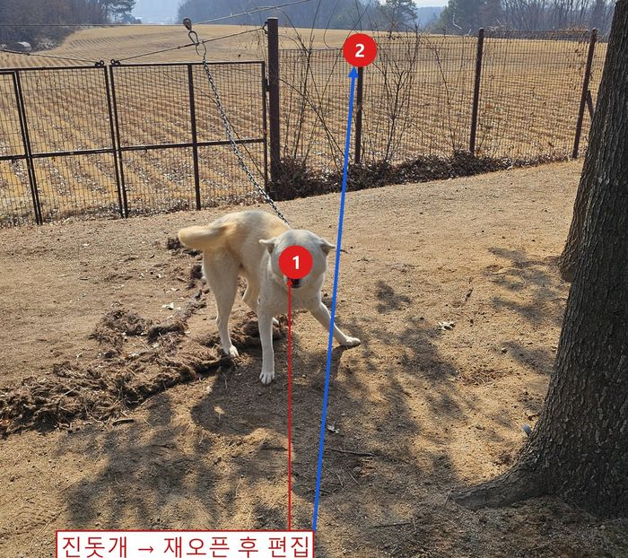
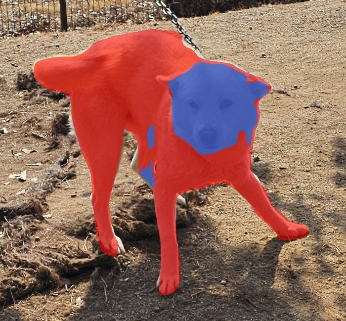
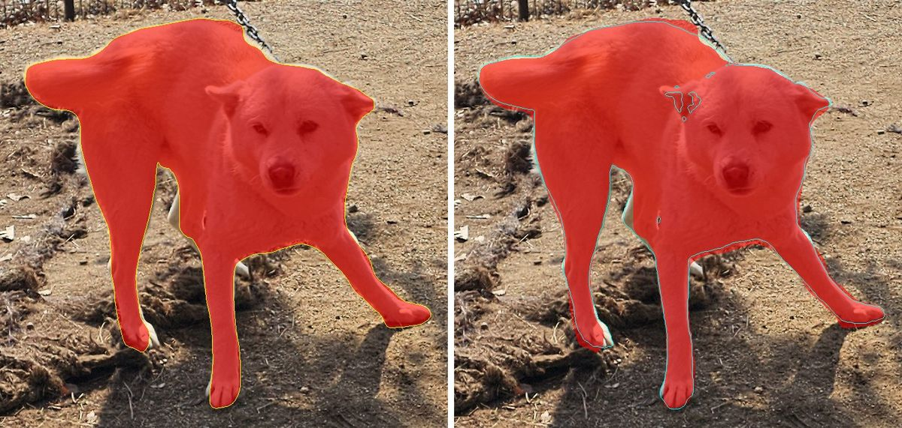
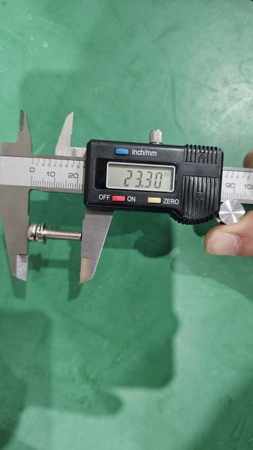
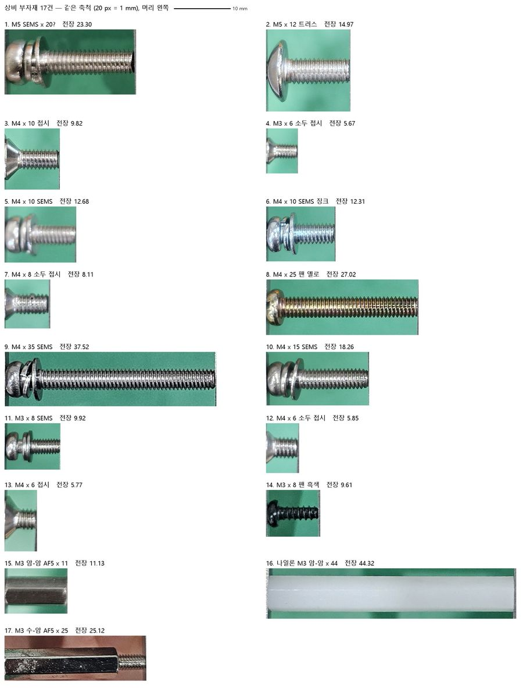
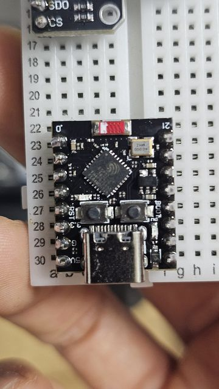

# 실제 사례: 이런 일을 시킬 수 있습니다

Paint.NET MCP를 실제 작업 네 건에 써 본 기록입니다. 사례마다 **무엇을 하고 싶었는지**, **AI에게 어떻게 요청하면 되는지**, **AI가 어떤 도구를 불렀는지**, **결과**, **막혔던 곳**을 순서대로 적었습니다. 따라 하려면 먼저 README의 [설치](../README.md#설치)와 [클라이언트 연결](../README.md#클라이언트-연결)을 마치고 Paint.NET을 켜 두세요.

| 사례 | 하는 일 | 주로 쓰는 도구 | 추가 설치 |
| --- | --- | --- | --- |
| [1. 사진에 번호와 설명 붙이기](#1-사진에-번호와-설명-붙이기) | 사진 속 물체에 마커·설명 박스·화살표 | `add_annotation` | 없음 |
| [2. 점 하나로 물체 선택하기](#2-점-하나로-물체-선택하기) | 개만, 개와 나무까지, 머리만 골라내기 | `select_object` | rembg |
| [3. 부품 사진 누끼 따서 목록 만들기](#3-부품-사진-누끼-따서-목록-만들기) | 볼트 17종을 배경 없이 모으고 규격 캡션 | `remove_background`, `create_text_layer` | rembg |
| [4. 브레드보드 배선도 그리기](#4-브레드보드-배선도-그리기) | 전자 부품 결선을 그림으로 | `draw_*`, `begin_batch` | 없음 |

요청 문장은 실제 작업을 바탕으로 다듬은 예시입니다. 그대로 쓰지 않아도 됩니다. AI가 요청에 맞는 도구를 고릅니다.

---

## 1. 사진에 번호와 설명 붙이기

**하고 싶은 것**: 현장 사진 속 물체에 번호를 붙이고, 무엇인지 설명 박스와 화살표로 표시하기.

### 이렇게 요청하세요

> 이 사진을 Paint.NET에서 열어줘: `C:\사진\현장.jpg`
> 개 위에 번호 마커 1을 찍고, 오른쪽 아래 빈 곳에 "관리견 (목줄 고정)" 설명 박스를 만들어서 박스에서 마커로 화살표를 그어줘. 나중에 옮기거나 글자를 고칠 수 있게 편집 가능한 주석으로 만들어줘.

이어서 이렇게 고칠 수 있습니다.

> 설명 박스를 왼쪽으로 옮기고 문구를 "진돗개 (검증용)"으로 바꿔줘.

> 다음에 다시 고칠 수 있게 `.pdn`으로 저장하고, 공유용 PNG도 내보내줘.

### AI가 하는 일

```text
open_image(path="C:\사진\현장.jpg")
add_annotation(type="marker",  properties={"x":972,"y":1000,"label":"1"})            → id marker1
add_annotation(type="callout", properties={"x":1200,"y":2200,"text":"관리견 (목줄 고정)"}) → id callout1
add_annotation(type="arrow",   from="callout1", to="marker1")
update_annotation(...)        # 옮기기·문구 바꾸기
save_pdn(...) / export_document(...)
```

좌표는 AI가 사진을 보고 정합니다. 주석을 만들면 `marker1` 같은 id가 돌아오고, 화살표는 그 id로 박스와 마커를 잇습니다.

### 결과

 

왼쪽은 처음 추가한 상태, 오른쪽은 `.pdn`을 다시 열어 문구를 바꾼 상태입니다. 박스가 넓어지자 화살표가 새 테두리에서 다시 시작합니다.

### 알아 두면 좋은 것

- **주석은 픽셀이 아니라 객체입니다.** 처음에는 `draw_callout`·`draw_marker`·`draw_arrow`로 그렸는데, 이건 픽셀이라 위치를 바꾸려면 지우고 다시 그려야 했습니다. 그래서 0.5.35에서 `add_annotation`을 만들었습니다. 지금은 주석이 레이어에 목록으로 저장되고, 박스를 옮기면 연결된 화살표가 따라옵니다.
- **연결된 것은 함부로 지워지지 않습니다.** 화살표가 가리키는 마커를 지우라고 하면 `marker2 is linked from arrow1; delete or relink those first.`처럼 이유를 대며 거부합니다. 화살표를 먼저 지우면 됩니다.
- 추가·수정·삭제는 각각 Undo 한 번으로 되돌아갑니다.
- **큰 사진의 전체 미리보기는 응답이 너무 길어 실패할 수 있습니다.** 4000픽셀 사진을 PNG로 통째로 받으려다 응답이 248만 자를 넘은 적이 있습니다. 일부 영역만 보거나(`x`, `y`, `width`, `height`) JPEG 형식으로 보여 달라고 요청하세요.

---

## 2. 점 하나로 물체 선택하기

**하고 싶은 것**: 사진에서 개만 골라내기. 필요하면 옆의 나무도 함께, 또는 개의 머리만.

마술봉 선택은 색이 비슷한 픽셀을 고를 뿐이라 흰 개와 마른 흙을 잘 구분하지 못합니다. `select_object`는 물체를 인식하는 SAM(Segment Anything) 모델로 윤곽을 찾고, 그 결과를 Paint.NET의 일반 선택 영역으로 만듭니다. 마술봉으로 만든 선택처럼 그 뒤에 자르기·복사·지우기를 이어서 할 수 있습니다.

### 준비

```text
pip install "rembg[cpu,cli]"
```

처음 실행할 때 SAM 모델(약 375 MB)을 내려받습니다.

### 이렇게 요청하세요

> 이 사진에서 개를 선택해줘. 개 몸통 쯤에 점을 찍으면 돼.

> 나무 줄기도 선택에 더해줘.

> 방금 더한 거 취소해줘.

> 개의 머리만 선택해줘. 몸통과 다리는 빼고.

> 선택한 부분만 남기고 잘라줘.

### AI가 하는 일

```text
select_object(include=[{"x":1100,"y":1700}])                                    # 개
select_object(include=[{"x":2120,"y":2000}], mode="union")                      # + 나무
undo()                                                                          # 나무만 취소
select_object(include=[{"x":...}], exclude=[{...},{...},{...}])                 # 머리만
crop_to_selection()                                                             # 잘라내기
```

좌표는 AI가 미리보기를 보고 정합니다. 위의 숫자는 예시입니다. 이 기록에서는 선택까지 확인했고 마지막 잘라내기는 실행하지 않았습니다.

`mode`로 지금 선택과 어떻게 합칠지 정합니다: `replace`(새로), `union`(더하기), `exclude`(빼기), `intersect`(겹치는 곳만), `xor`.

### 결과

 

| 요청 | 선택 범위 (2252×4000 사진) |
| --- | --- |
| 개 몸통에 점 하나 | 654×635 |
| 나무 줄기 점을 `union`으로 더하기 | 1612×1948 |
| Undo 한 번 | 다시 개만 |

한 번에 약 6초 걸립니다. 캔버스 밖 점이나 모르는 `mode`는 선택을 건드리지 않고 거부합니다.

### 알아 두면 좋은 것

- **SAM은 보이는 그림 전체를 봅니다.** 지금 고른 레이어가 아니라 화면에 보이는 합성 결과에서 물체를 찾습니다.
- **가장자리가 배경으로 번지던 문제는 0.5.37에서 고쳤습니다.** SAM은 사진을 긴 변 1024픽셀로 줄여서 보기 때문에, 큰 사진에서는 털 경계가 5–15픽셀 넘쳤습니다. 지금은 한 번 찾은 물체 주변만 잘라 다시 돌려서 경계가 털에 붙습니다.

  

  왼쪽 노란 선이 0.5.36, 오른쪽 하늘색 선이 0.5.37입니다.
- **구멍이 생기면 점 하나를 더 찍으세요.** 경계가 정밀해진 대신 귀 안쪽처럼 어두운 부분이 빠질 수 있습니다(실험에서 723픽셀). 그 자리에 `union` 점을 하나 더하면 메워집니다. "귀 안쪽이 빠졌으니 거기도 더해줘"라고 요청하면 됩니다.

---

## 3. 부품 사진 누끼 따서 목록 만들기

**하고 싶은 것**: 캘리퍼로 잰 볼트 사진 수십 장에서 볼트만 오려 한 장에 모으고, 번호와 규격을 적기.

### 준비

```text
pip install "rembg[cli]"
```

`remove_background`의 `method="ai"`가 rembg를 씁니다. 처음 실행할 때 모델을 내려받느라 오래 걸리고, 그동안 요청이 시간 초과로 실패할 수 있습니다. 그러면 같은 요청을 한 번 더 하세요.

### 이렇게 요청하세요

실제로 쓴 요청입니다.

> 각 볼트 사진들 누끼를 따서 하나로 모으고, 번호를 매긴 다음 질문 혹은 확정된 규격을 적어줘. 사진은 `G:\...\Temp` 폴더의 `20261007_17*.jpg`야.

### AI가 하는 일

```text
open_image(path=".../20261007_170318.jpg")                                          # 사진마다
remove_background(x=..., y=..., width=..., height=..., method="ai", savePath=".../c01.png")
...
create_text_layer(text="1  M5 샘스, 길이 20 추정", ...)                               # 칸마다 캡션
save_pdn(...) / export_document(...)
```

이 작업에서 실제로 부른 횟수는 `open_image` 35번, `remove_background` 32번, `create_text_layer` 118번이었습니다. 캘리퍼 화면의 숫자는 OCR 도구가 아니라 AI가 사진을 직접 보고 읽었습니다.

### 결과

 

왼쪽이 원본 사진, 오른쪽이 결과 보드의 윗줄입니다(전체 17칸). 캡션은 텍스트 레이어라 `.pdn`에서 글자를 고칠 수 있습니다.

### 알아 두면 좋은 것

- **누끼 영역은 넉넉하게 잡으세요.** 첫 시도에서 1번 볼트의 머리가 잘려 영역을 넓혀 다시 땄습니다.
- **MCP로 하지 않는 게 나은 일도 있습니다.** 이 보드는 사진마다 배율이 달라 볼트 크기를 서로 비교할 수 없었습니다. 캘리퍼 턱 사이 간격이 곧 전장이라는 규칙으로 축척을 맞추고 기울기를 펴는 일은 사진마다 판단할 필요가 없어서, 짧은 Python 스크립트로 처리했습니다. 사람 눈이 필요한 일(누끼, 캡션 배치)은 MCP에, 규칙으로 끝나는 일은 스크립트에 맡기는 편이 빠르고 다시 돌리기도 쉽습니다.

  

---

## 4. 브레드보드 배선도 그리기

**하고 싶은 것**: ESP32 보드와 센서 두 개를 점퍼선 10개로 잇는 결선을 그림으로 그리기. 글로 된 설명이 길어지자 "글로 보니까 어지러워지기 시작함"이라는 요청이 나왔습니다.

### 이렇게 요청하세요

> 빵판 그림 좀 그려줘. 왼쪽에 ENS160·BME688 모듈, 아래에 ESP32-C3, 점퍼 10개는 번호를 붙여서 양 끝을 같은 번호로 표시해줘. 전원선·신호선·모듈·글자는 레이어를 나눠서 나중에 고칠 수 있게 해줘.

이어서 이렇게 고쳤습니다.

> 신호선 10번이 마커 3번 숫자를 가려. 레이어 순서를 바꿔줘.

> 실제로 꽂은 사진 보고 틀린 곳을 '고칠 곳' 레이어에 표시해줘.

> BME688은 위아래 뒤집어서 꽂아야 해. 여유 구멍이 없거든. 그에 맞게 다시 그려줘.

### AI가 하는 일

```text
open_image(path=".../bb_base.png")        # 빈 구멍 격자만 미리 만든 바탕
add_layer(name="전원선 1-6")
begin_batch()
draw_line(...); draw_marker(..., label="1"); ...
end_batch()                                # 묶은 그리기는 Undo 한 번에 통째로 되돌아감
move_layer(...)                            # 순서 바꾸기
save_pdn(...) / export_document(...)
```

실제 호출 횟수는 `draw_text` 118번, `draw_marker` 60번, `draw_rectangle` 55번, `draw_line` 30번, `draw_arrow` 4번, 배치 묶음 13번이었습니다. 모듈의 핀 이름은 AI가 모듈 사진을 보고 읽었습니다.

### 결과

 

최종 파일은 레이어 7장입니다: 연결 구조, 모듈, 신호선 7-10, 전원선 1-6, 글자, 고칠 곳, 격자 바탕.

### 알아 두면 좋은 것

- **처음부터 레이어를 나눠 달라고 하세요.** 처음엔 한 장에 다 그렸다가 수정 이력을 남기려고 다시 그렸습니다. 레이어가 나뉘어 있으면 "선이 숫자를 가린다" 같은 문제를 그림은 그대로 두고 순서만 바꿔 풉니다.
- **간격은 미리 정해 주세요.** 핀 이름 줄 간격이 브레드보드 행 간격(40픽셀)과 안 맞아 한 번 되돌리고 한 줄씩 다시 찍었습니다.
- **연결 오류가 나면**: `bridge_unavailable`은 다른 AI 세션이 Paint.NET 연결을 쥐고 있을 때 납니다. 서버는 연결을 하나만 받습니다. 다른 세션을 닫거나 그 세션의 서버 프로세스를 끄세요. `paintdotnet_not_running`은 Paint.NET이 꺼져 있다는 뜻입니다.

---

## 네 사례에서 얻은 요령

1. **되돌릴 수 있다는 걸 믿고 시켜 보세요.** 작업 하나하나가 Undo 한 번으로 되돌아가고, 잘못된 요청은 이유와 함께 거부됩니다.
2. **다시 고칠 일이 있으면 `.pdn`으로 저장해 달라고 하세요.** 편집 가능한 주석과 텍스트 레이어는 다시 열어도 고칠 수 있습니다. PNG는 공유용입니다.
3. **규칙으로 끝나는 반복은 스크립트가 낫습니다.** 수십 장에 같은 계산을 적용하는 일은 MCP보다 스크립트가 빠르고 다시 돌리기도 쉽습니다. MCP는 사람이 화면을 보며 판단할 일에 쓰세요.
